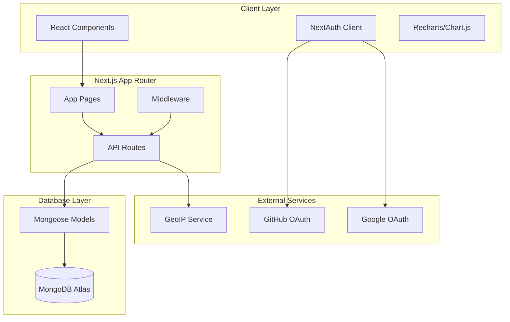
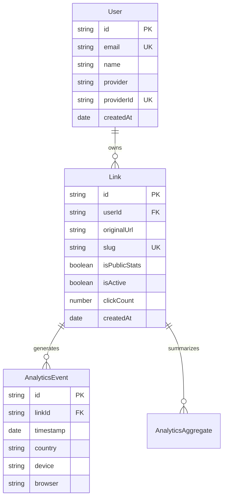

# Design Document

## Overview

El redireccionador de URLs será una aplicación web full-stack construida con Next.js 14 usando App Router. La arquitectura seguirá un patrón de separación clara entre frontend, backend API y base de datos, con énfasis en rendimiento, seguridad y experiencia de usuario.

La aplicación constará de:

- **Frontend**: Interfaz React con TailwindCSS para styling responsivo
- **Backend**: API Routes de Next.js para lógica de negocio
- **Autenticación**: NextAuth.js con proveedores OAuth
- **Base de datos**: MongoDB Atlas con Mongoose para modelado de datos
- **Analytics**: Sistema de captura y procesamiento de métricas en tiempo real
- **Deployment**: Vercel con variables de entorno configuradas

## Architecture



### Core Architecture Principles

1. **Server-Side Rendering**: Páginas públicas renderizadas en servidor para SEO
2. **Client-Side Navigation**: Dashboard con navegación fluida usando React
3. **API-First Design**: Todas las operaciones de datos a través de API endpoints
4. **Middleware Protection**: Rutas protegidas con verificación de autenticación
5. **Optimistic Updates**: UI responsiva con actualizaciones optimistas

## Components and Interfaces

### Frontend Components

#### Layout Components

- `RootLayout`: Layout principal con providers y configuración global
- `DashboardLayout`: Layout del dashboard con sidebar y navegación
- `AuthLayout`: Layout para páginas de autenticación

#### Feature Components

- `LinkCreator`: Formulario para crear nuevos enlaces
- `LinkList`: Lista de enlaces del usuario con acciones CRUD
- `LinkEditor`: Modal/página para editar enlaces existentes
- `StatsViewer`: Componente principal de estadísticas con gráficas
- `PublicStats`: Vista pública de estadísticas (opcional)

#### UI Components

- `Button`: Componente de botón reutilizable con variantes
- `Input`: Campo de entrada con validación
- `Modal`: Modal reutilizable para confirmaciones
- `ThemeToggle`: Selector de tema claro/oscuro
- `LoadingSpinner`: Indicador de carga
- `ErrorBoundary`: Manejo de errores en componentes

### API Endpoints

#### Authentication

- `GET /api/auth/[...nextauth]`: NextAuth.js endpoints
- `GET /api/auth/session`: Obtener sesión actual

#### Links Management

- `GET /api/links`: Obtener enlaces del usuario autenticado
- `POST /api/links`: Crear nuevo enlace
- `PUT /api/links/[id]`: Actualizar enlace existente
- `DELETE /api/links/[id]`: Eliminar enlace
- `GET /api/links/[id]/stats`: Obtener estadísticas de un enlace

#### Analytics

- `POST /api/analytics/click`: Registrar clic en enlace
- `GET /api/analytics/[linkId]`: Obtener datos de análisis
- `GET /api/analytics/export`: Exportar datos (CSV/JSON)

#### Public Routes

- `GET /[slug]`: Redirección pública
- `GET /stats/[linkId]`: Estadísticas públicas (si habilitadas)

### Database Interfaces

#### User Model

```typescript
interface User {
  id: string;
  email: string;
  name: string;
  image?: string;
  provider: 'github' | 'google';
  providerId: string;
  createdAt: Date;
  updatedAt: Date;
}
```

#### Link Model

```typescript
interface Link {
  id: string;
  userId: string;
  originalUrl: string;
  slug: string;
  title?: string;
  description?: string;
  isPublicStats: boolean;
  isActive: boolean;
  createdAt: Date;
  updatedAt: Date;
  clickCount: number;
}
```

#### Analytics Model

```typescript
interface AnalyticsEvent {
  id: string;
  linkId: string;
  timestamp: Date;
  ip: string; // Hashed for privacy
  country: string;
  city: string;
  region: string;
  language: string;
  userAgent: string;
  device: 'mobile' | 'tablet' | 'desktop';
  os: string;
  browser: string;
  referrer?: string;
}
```

## Data Models

### MongoDB Collections

#### users

- Índices: `email` (único), `providerId` (único)
- TTL: No aplica (datos permanentes)

#### links

- Índices: `userId`, `slug` (único), `createdAt`
- Validaciones: URL válida, slug único, usuario existente

#### analytics_events

- Índices: `linkId`, `timestamp`, `country`
- Particionado por fecha para optimizar consultas temporales
- TTL: Opcional (retención de datos configurable)

#### analytics_aggregates (para optimización)

- Datos pre-agregados por día/país/dispositivo
- Actualizados mediante jobs en background
- Índices: `linkId`, `date`, `dimension`

### Data Relationships



## Error Handling

### Client-Side Error Handling

- **React Error Boundaries**: Captura errores en componentes
- **Toast Notifications**: Mensajes de error user-friendly
- **Form Validation**: Validación en tiempo real con feedback visual
- **Network Errors**: Retry automático con backoff exponencial

### Server-Side Error Handling

- **API Error Responses**: Formato consistente con códigos HTTP apropiados
- **Database Errors**: Manejo de errores de conexión y validación
- **Authentication Errors**: Redirección apropiada y mensajes claros
- **Rate Limiting**: Protección contra abuso con límites por IP/usuario

### Error Response Format

```typescript
interface ApiError {
  success: false;
  error: {
    code: string;
    message: string;
    details?: any;
  };
  timestamp: string;
}
```

### Custom Error Pages

- `404.tsx`: Página no encontrada con sugerencias
- `500.tsx`: Error del servidor con opción de reportar
- `error.tsx`: Error boundary para App Router

## Testing Strategy

### Unit Testing

- **Components**: Testing Library para componentes React
- **API Routes**: Supertest para endpoints
- **Utilities**: Jest para funciones puras
- **Models**: Mongoose model validation testing

### Integration Testing

- **Authentication Flow**: E2E testing del flujo OAuth
- **Link Creation**: Flujo completo desde UI hasta DB
- **Analytics Pipeline**: Verificar captura y agregación de datos
- **Redirection**: Testing de URLs cortas y redirecciones

### Performance Testing

- **Database Queries**: Profiling de consultas MongoDB
- **API Response Times**: Benchmarking de endpoints críticos
- **Frontend Performance**: Lighthouse CI en pipeline
- **Load Testing**: Artillery.js para endpoints públicos

### Testing Tools

- **Jest**: Test runner principal
- **React Testing Library**: Testing de componentes
- **Playwright**: E2E testing
- **MongoDB Memory Server**: Testing de base de datos
- **MSW**: Mocking de APIs externas

### Test Coverage Goals

- **Unit Tests**: >90% coverage en utilities y models
- **Integration Tests**: Flujos críticos cubiertos
- **E2E Tests**: Happy paths y casos de error principales
- **Performance Tests**: Métricas baseline establecidas

## Security Considerations

### Authentication Security

- **OAuth Flow**: Validación de state parameter
- **Session Management**: Tokens JWT seguros con rotación
- **CSRF Protection**: NextAuth.js built-in protection
- **Rate Limiting**: Límites en endpoints de autenticación

### Data Protection

- **IP Hashing**: IPs almacenadas con hash SHA-256
- **Environment Variables**: Secrets en variables de entorno
- **Database Security**: Conexión encriptada a MongoDB Atlas
- **Input Validation**: Sanitización de todas las entradas

### API Security

- **Authentication Middleware**: Verificación en rutas protegidas
- **CORS Configuration**: Configuración restrictiva de CORS
- **Request Validation**: Zod schemas para validación de entrada
- **SQL Injection Prevention**: Mongoose ODM como protección

## Performance Optimizations

### Frontend Optimizations

- **Code Splitting**: Lazy loading de componentes pesados
- **Image Optimization**: Next.js Image component
- **Bundle Analysis**: Webpack Bundle Analyzer
- **Caching**: SWR para cache de datos del cliente

### Backend Optimizations

- **Database Indexing**: Índices optimizados para consultas frecuentes
- **Query Optimization**: Agregaciones eficientes para estadísticas
- **Caching Layer**: Redis para datos frecuentemente accedidos
- **CDN**: Vercel Edge Network para assets estáticos

### Monitoring and Analytics

- **Performance Monitoring**: Vercel Analytics
- **Error Tracking**: Sentry para errores en producción
- **Database Monitoring**: MongoDB Atlas monitoring
- **Custom Metrics**: Métricas de negocio personalizadas
